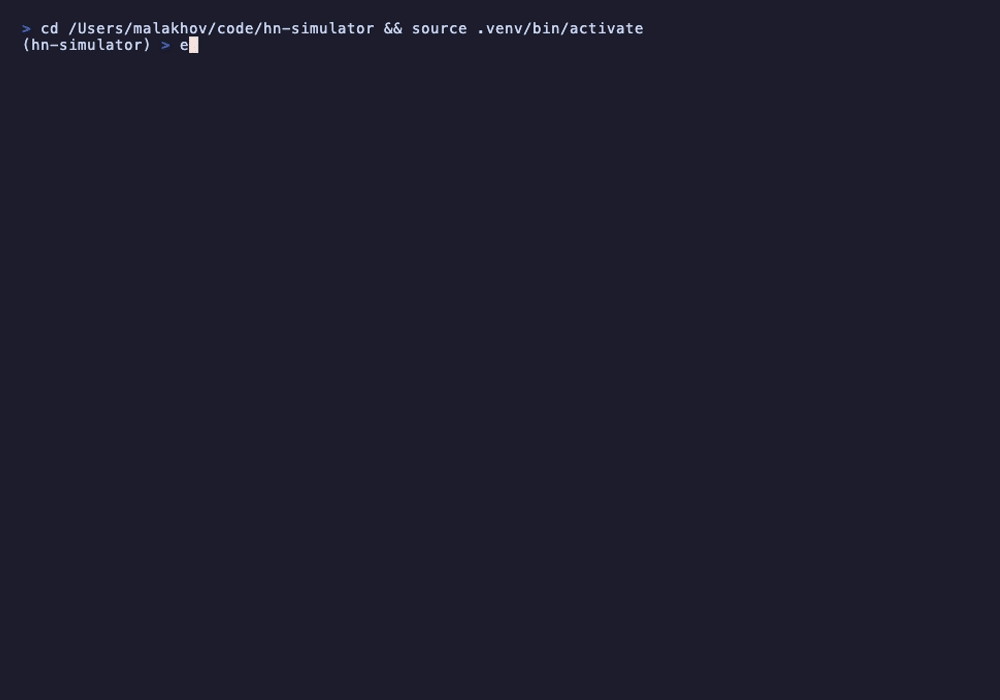

# hackernews-simulator

> Predict how Hacker News will react to your post before you submit it.

[](https://www.python.org/downloads/)
[](LICENSE)

An ML-powered tool that predicts your Hacker News score, generates realistic simulated comments, and explains *why* your post will perform the way it will. Uses LightGBM for scoring, LanceDB for finding similar historical posts, and Claude for comment simulation.



## The Meta Test

We ran hackernews-simulator on its own Show HN post. Here's what it predicted:

```
╭─────────────────────── HN Reaction Simulator ────────────────────────╮
│ Show HN: hackernews-simulator – predict how HN will react to your    │
│ post before you submit it                                            │
╰──────────────────────────────────────────────────────────────────────╯

  Predicted Score:    ~4 points
  Reception: LOW (78% confidence)
  Percentile: Top 68.8% of HN stories
  Expected Score: ~10 points (multiclass)

  Why This Score:
  ↓ title_word_count (-0.01)
  ↓ has_url (-0.01)

  Simulated Comments:

  xkcd_fan_42: So you trained a model to predict HN reactions, and your
  own tool predicted a score of 4 for this post. That's either
  refreshingly honest or a sign you should have iterated more.

  throwaway_ml: This is a Claude wrapper that calls itself ML. LightGBM
  for the score prediction is fine, but the 'realistic simulated
  comments' part is just prompting an LLM. That's not a prediction,
  that's fanfiction.

  old_hn_lurker: Someone builds one of these every couple of years. The
  fundamental problem is that HN engagement is a fat-tailed distribution
  — most posts get 0-5 points regardless of quality, and virality is
  driven by a handful of power users and algorithmic timing.

  vecdb_curious: The LanceDB RAG piece is actually the most interesting
  part. Using similar historical posts as context for comment generation
  is a clever approach.
```

The tool is brutally honest about itself. We ship it anyway.

---

## Quick Start

```bash
# Install
pip install git+https://github.com/malakhov/hackernews-simulator.git

# Download pre-trained models (~400MB)
hn-sim init

# Predict!
hn-sim predict --title "Show HN: My Cool Project"
```

Or with [uv](https://docs.astral.sh/uv/):

```bash
uv pip install git+https://github.com/malakhov/hackernews-simulator.git
```

## Features

### Predict Score + Simulated Comments

```bash
hn-sim predict --title "Show HN: I made a database in 500 lines of C"
```

Generates:
- Predicted score and comment count
- Reception label (flop / low / moderate / hot / viral) with confidence
- Percentile ranking ("Top X% of HN stories")
- 3-5 simulated HN-style comments with realistic usernames and tones
- SHAP-based explanation of *why* this score
- Best posting time recommendation

### Compare Variants

Test multiple titles against each other:

```bash
hn-sim predict --title "Why Rust is the future" --no-comments
hn-sim predict --title "Show HN: I rewrote our API in Rust, here are the benchmarks" --no-comments
```

Or use YAML for batch comparison:

```yaml
# variants.yaml
variants:
  - title: "Show HN: My project"
    description: "A cool project"
  - title: "Ask HN: Would you use this?"
    description: "Thinking about building..."
```

```bash
hn-sim compare --variants variants.yaml
```

### Suggest Loop (AI Title Optimization)

Let Claude iteratively improve your title:

```bash
hn-sim suggest-loop --title "My project" --max-iterations 5
```

Each iteration generates new variants, scores them, and keeps improving until convergence.

### Web UI

```bash
pip install hackernews-simulator[ui]
hn-sim ui
```

Full Streamlit interface with predict, compare, and suggest tabs.

### Backtest

Evaluate model accuracy on held-out data:

```bash
hn-sim backtest
```

## How It Works

```
Your Title + Description
         │
         ├──→ [Feature Engineering]
         │      15 structural features (title length, domain, time, etc.)
         │      + 384-dim sentence embeddings (MiniLM-L6-v2)
         │      + domain reputation (Bayesian smoothed)
         │      = 399-dimensional feature vector
         │
         ├──→ [LightGBM Ensemble]
         │      Regression model → predicted score
         │      5-class classifier → reception label + confidence
         │      SHAP TreeExplainer → "why this score"
         │
         ├──→ [LanceDB RAG]
         │      Vector search → 5 most similar historical posts
         │      + their real comment threads
         │
         └──→ [Claude CLI]
                System prompt with HN culture rules
                + similar posts as few-shot examples
                → 5 simulated comments with realistic tones

Training data: 144K stories + 319K comments from open-index/hacker-news (2023-2025)
```

## Requirements

- **Python 3.11+**
- **Claude Code CLI** — for comment generation and title suggestions ([install](https://docs.anthropic.com/en/docs/claude-code)). No API key needed — uses your Claude Code subscription.
- ~400MB disk for pre-trained models

Without Claude CLI, score prediction and SHAP explanations still work — only comment generation and suggest-loop require it.

## Train Your Own Model

```bash
# Full pipeline from scratch (downloads ~2GB, takes ~30min)
hn-sim init --from-scratch

# Or step by step:
hn-sim fetch --sample-size 200000
hn-sim train
hn-sim build-index
```

## Limitations

We believe in honesty:

- **~60-70% accuracy ceiling** — HN engagement is dominated by social cascade effects (who sees it first, early vote momentum) that are fundamentally unpredictable from content alone
- **Score prediction is relative, not absolute** — the model is better at ranking ("A will outperform B") than exact numbers
- **Training data is 2023-2025** — cultural drift will degrade accuracy over time
- **Comment generation requires Claude Code CLI** — without it, you get scores but no simulated comments
- **"Show HN" posts have different dynamics** than regular submissions

The tool is most useful as a **probability advisor and creative testing tool**, not an oracle.

## Contributing

See [CONTRIBUTING.md](CONTRIBUTING.md).

## License

MIT — see [LICENSE](LICENSE).
